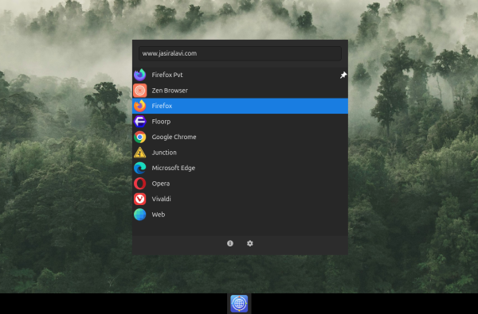
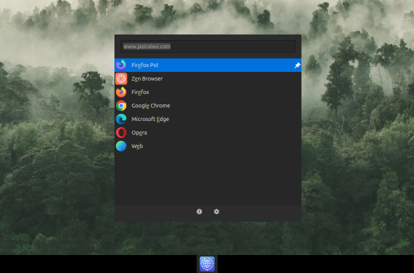

# OpenNav

**OpenNav** is a lightweight, keyboard-centric browser selector/launcher written in Rust using GTK4. 

-   Launch any browser that's installed in your system
-   Open links in browser of your choice (just set OpenNav as your default browser)
-   Launch searches with search engines of your choice in the browser of your choice 
-   (yes, you can add/manage search engines in OpenNav and configure keywords)
-   Launch in a specific profile (just create a .desktop file for it)

It automatically detects your installed browsers and lets you quickly select which one to launch, search something or open a link with. It learns your preferences over time, sorting your most-used or most recently used browsers to the top (or just set it to list alphabetically).

<div align="center">
  
</div>
<br>
<div align="center">
  
</div>
<div align="center">
  
</div>

## Features

-   🚀 **Fast Startup**: Optimized for instant launch.
-   ⌨️ **Keyboard Driven**: Navigate, filter, and launch without touching the mouse.
-   🔍 **Smart Filtering**: Type to filter browsers instantly.
-   📌 **Pinning**: Keep your favorite browsers pinned to the top (`Ctrl+P`).
-   📊 **Usage Sorting**: Automatically sorts browsers by usage frequency.
-   🛠️ **Customizable**: Supports custom icons (including absolute paths) and recognizes Flatpaks.
-   🌑 **Modern UI**: Dark theme support with readable styling.

## Installation

### AppImage (Portable)

Download the `.AppImage` from the [Releases](https://github.com/jasiralavi/opennav/releases) page.
```bash
chmod +x OpenNav-x86_64.AppImage
./OpenNav-x86_64.AppImage
```

### From Source (Rust)

1.  **Dependencies**:
    -   Fedora: `sudo dnf install gtk4-devel gcc`
    -   Ubuntu/Debian: `sudo apt install libgtk-4-dev build-essential`

2.  **Build & Run**:
    ```bash
    git clone https://github.com/jasiralavi/opennav.git
    cd opennav
    cargo run --release -- https://cyfersolutions.com
    ```

3.  **Install Desktop Entry** (Required for icons/integration):
    ```bash
    # Update paths in opennav.desktop if needed, then:
    cp opennav.desktop ~/.local/share/applications/com.opennav.app.desktop
    update-desktop-database ~/.local/share/applications/
    ```

### Flatpak (Local Build)

See [distribution.md](distribution.md) or `flatpak/` folder for instructions on building a local Flatpak.

## How to Use

OpenNav serves two main purposes:

1.  **Browser Picker**: When you click a link in another app (like Discord or Slack), OpenNav pops up, letting you choose which browser to open that specific link in.
2.  **Quick Launcher**: You can launch OpenNav directly to quickly open any of your installed browsers, optionally typing a URL to go straight there.
3.  **Direct Web Search**: Type a search query (e.g., "rust lang") in the URL bar and select a browser. OpenNav will automatically detect it's a search term and perform a web search using the browser's default search engine (or Google).

### Configuration

#### Set as Default Browser
To make OpenNav your browser picker, you must set it as your system's **Default Web Browser**:
-   **GNOME**: Settings -> Default Applications -> Web. Select "OpenNav".
-   **KDE Plasma**: System Settings -> Applications -> Default Applications -> Web Browser. Select "OpenNav".

#### Quick Launch Shortcut
To open OpenNav instantly with a keyboard shortcut (e.g., `Super+B` or `Ctrl+Alt+B`):
1.  Open your desktop environment's **Keyboard Shortcuts** settings.
2.  Add a new custom shortcut.
3.  Set the command to: `opennav` (or the path to your AppImage if using that).
4.  Assign your preferred key combination.

## Shortcuts

| Key | Action |
| :--- | :--- |
| **Type** | Filter list |
| **Ctrl + L** | Focus URL Bar |
| **Up / Down** | Navigation |
| **Enter / Click** | Launch Selected |
| **Ctrl + Enter** | Launch & Keep Open |
| **Ctrl + Click** | Launch & Keep Open |
| **Ctrl + P** | Pin/Unpin Browser |
| **Ctrl + S** | Open Settings |
| **Ctrl + ?** | Show Shortcuts |
| **Esc** | Close / Clear Search |


## Adding Custom Profiles (Firefox & Chrome)

OpenNav detects browsers by scanning your system's `.desktop` files. To add a specific browser profile (like "Work" or "Personal"), you need to create a custom desktop entry for it.

### Firefox Profile
1.  **Create Profile**: Run `firefox -P` in your terminal to create a new profile (e.g., named "Work").
2.  **Create Desktop File**: Create `~/.local/share/applications/firefox-work.desktop`.
3.  **Add Content**:
    ```ini
    [Desktop Entry]
    Name=Firefox Work
    Exec=firefox -P "Work" %u
    Icon=firefox
    Type=Application
    MimeType=x-scheme-handler/http;x-scheme-handler/https;
    ```
    > **Note**: The `-P "ProfileName"` flag is the key part.

### Chrome Profile
1.  **Find Profile Path**: Chrome uses internal names like "Profile 1". Run `ls ~/.config/google-chrome/ | grep Profile` to list them.
2.  **Verify**: Test with `google-chrome --profile-directory="Profile 1"`.
3.  **Create Desktop File**: Create `~/.local/share/applications/chrome-work.desktop`.
4.  **Add Content**:
    ```ini
    [Desktop Entry]
    Name=Chrome Work
    Exec=/usr/bin/google-chrome --profile-directory="Profile 1" %U
    Icon=google-chrome
    Type=Application
    MimeType=x-scheme-handler/http;x-scheme-handler/https;
    ```

### Important: Update Database
After creating any `.desktop` file, you **must** run this command for OpenNav to detect the new entry:

```bash
update-desktop-database ~/.local/share/applications
```

## License

GNU General Public License v3.0
